# Meetfy - dokumentacja projektu frontendowego

> Screeny do dokumentacji powinny znajdowac sie w folderze `screenshots/` zgodnie z nazwami podanymi w tej dokumentacji. GitHub automatycznie wyswietli obrazy osadzone skladnia Markdown.

## 1. Informacje ogólne o projekcie

Meetfy to aplikacja internetowa przygotowana w ramach przedmiotu Techniki Projektowania Frontendowego. Celem projektu było stworzenie nowoczesnego interfejsu użytkownika dla platformy służącej do odkrywania, tworzenia i zapisywania wydarzeń społecznych. Aplikacja została zaprojektowana jako frontendowa aplikacja SPA, czyli Single Page Application, oparta o React, Vite oraz React Router.

Projekt skupia się na warstwie frontendowej, dlatego główne dane aplikacji, takie jak wydarzenia, preferencje użytkownika, lista ulubionych wydarzeń oraz lista wydarzeń użytkownika, są przechowywane lokalnie po stronie przeglądarki z wykorzystaniem localStorage. Logowanie i rejestracja zostały zrealizowane z użyciem Firebase Authentication, zgodnie z wymaganiami prowadzącego.

Aplikacja została również wdrożona publicznie z użyciem Railway, a następnie zintegrowana z narzędziami analitycznymi Google Analytics oraz Hotjar/Contentsquare.

**Zrzut ekranu: strona główna aplikacji**

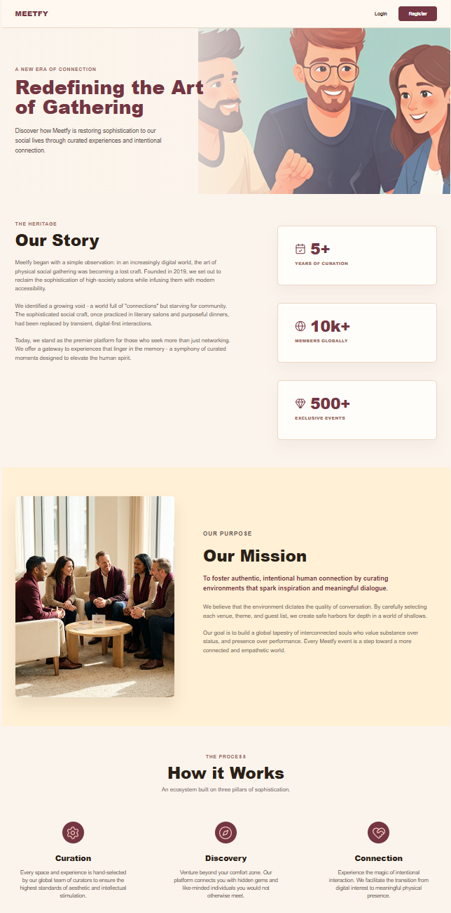

## 2. Zakres funkcjonalny aplikacji

Aplikacja Meetfy zawiera następujące widoki:

- Home Page - strona główna dla niezalogowanych użytkowników.
- Login Page - logowanie użytkownika przez Firebase Authentication.
- Register Page - rejestracja użytkownika przez Firebase Authentication.
- Preferences Creator - formularz wyboru preferencji użytkownika.
- User Dashboard - panel użytkownika z rekomendowanymi wydarzeniami.
- Search Page - strona wyszukiwania i filtrowania wydarzeń.
- Favorites Page - lista ulubionych wydarzeń.
- My Events Page - lista wydarzeń, do których użytkownik dołączył lub które utworzył.
- Create Event Page - formularz tworzenia nowego wydarzenia.
- My Account Page - edycja profilu użytkownika oraz avataru.
- Contact Page - formularz kontaktowy.
- Event Details Modal - modal ze szczegółami wydarzenia.

Aplikacja umożliwia między innymi:

- rejestrację konta,
- logowanie i wylogowanie,
- zapis preferencji użytkownika,
- edycję profilu,
- zmianę avataru,
- tworzenie nowych wydarzeń,
- dodawanie własnego obrazu wydarzenia,
- dodawanie wydarzeń do ulubionych,
- usuwanie wydarzeń z ulubionych,
- dołączanie do wydarzeń,
- usuwanie wydarzeń z listy My Events,
- wyszukiwanie wydarzeń po frazie,
- filtrowanie wydarzeń po kategorii, cenie, dacie i lokalizacji,
- przeglądanie szczegółów wydarzenia w modalu,
- korzystanie z karuzeli wydarzeń na dashboardzie, stronie ulubionych oraz stronie My Events.
## 3. Wykorzystane technologie

W projekcie wykorzystano następujące technologie:

- React - biblioteka JavaScript do budowy interfejsu użytkownika.
- Vite - narzędzie do szybkiego uruchamiania i budowania aplikacji frontendowych.
- React Router - obsługa routingu w aplikacji SPA.
- CSS - ręcznie pisane style dla poszczególnych widoków i komponentów.
- Firebase Authentication - logowanie i rejestracja użytkowników.
- localStorage - lokalne przechowywanie danych aplikacyjnych.
- Google Analytics - analiza ruchu i przejść użytkowników po aplikacji.
- Hotjar/Contentsquare - analiza zachowania użytkowników, heatmapy i sesje.
- Railway - deploy aplikacji na publicznym URL.
## 4. Struktura projektu

Projekt został zorganizowany w sposób komponentowy. Widoki znajdują się w folderze pages, natomiast elementy współdzielone w folderze components.

Struktura projektu:
```bash
src/
  assets/
  components/
    EventCards/
      DashboardEventCard.jsx
      FavoriteEventCard.jsx
      MyEventCard.jsx
      PastEventCard.jsx
      SearchEventCard.jsx
    Form/
      Button.jsx
      FormInput.jsx
      FormTextarea.jsx
    AppLayout.jsx
    Header.jsx
    Sidebar.jsx
    Footer.jsx
    EventDetailsModal.jsx
  context/
    AppDataContext.jsx
  data/
    initialEvents.js
    initialUsers.js
  firebase/
    firebase.js
  pages/
    HomePage.jsx
    LoginPage.jsx
    RegisterPage.jsx
    PreferencesCreator.jsx
    UserDashboard.jsx
    SearchPage.jsx
    FavoritesPage.jsx
    MyEventsPage.jsx
    CreateEventPage.jsx
    MyAccountPage.jsx
    ContactPage.jsx
  utils/
    storage.js
  App.jsx
  main.jsx
  index.css
```

Każdy główny widok posiada oddzielny plik JSX oraz oddzielny plik CSS. Pozwala to zachować czytelność kodu i ułatwia dalszy rozwój projektu.

## 5. Routing aplikacji

Routing aplikacji został zrealizowany z użyciem React Router. Aplikacja posiada osobne trasy dla widoków publicznych oraz widoków dostępnych po zalogowaniu.
```bash
/               - HomePage
/login          - LoginPage
/register       - RegisterPage
/preferences    - PreferencesCreator
/contact        - ContactPage
/dashboard      - UserDashboard
/search         - SearchPage
/favorites      - FavoritesPage
/events         - MyEventsPage
/account        - MyAccountPage
/create-event   - CreateEventPage
```

Widoki użytkownika po zalogowaniu są renderowane w ramach wspólnego layoutu, który zawiera nagłówek, sidebar oraz stopkę. Dzięki temu aplikacja ma spójny wygląd i nawigację.

**Zrzut ekranu: dashboard po zalogowaniu**

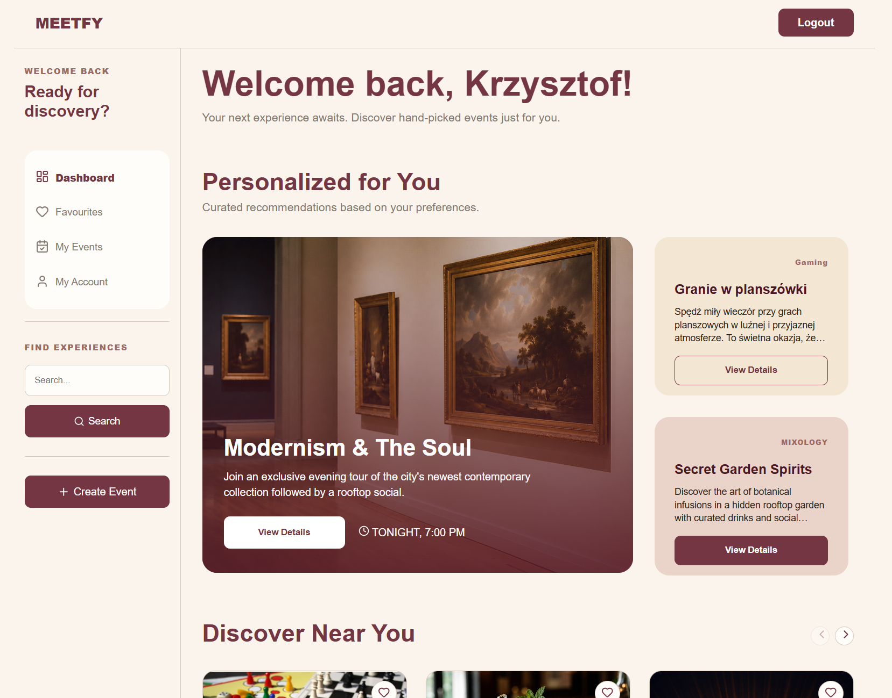

## 6. Firebase Authentication

Zgodnie z wymaganiami projektu logowanie i rejestracja użytkowników zostały zrealizowane z wykorzystaniem Firebase Authentication. W projekcie wykorzystano logowanie za pomocą adresu email oraz hasła.

Konfiguracja Firebase znajduje się w pliku:
```bash
src/firebase/firebase.js
```

Dane konfiguracyjne Firebase zostały zapisane jako zmienne środowiskowe z prefiksem VITE_, na przykład:
```bash
VITE_FIREBASE_API_KEY=...
VITE_FIREBASE_AUTH_DOMAIN=...
VITE_FIREBASE_PROJECT_ID=...
VITE_FIREBASE_STORAGE_BUCKET=...
VITE_FIREBASE_MESSAGING_SENDER_ID=...
VITE_FIREBASE_APP_ID=...
VITE_FIREBASE_MEASUREMENT_ID=...
```

W aplikacji obsługiwane są następujące operacje:

- rejestracja użytkownika,
- logowanie użytkownika,
- wylogowanie użytkownika,
- odczyt aktualnie zalogowanego użytkownika.

Po rejestracji użytkownik jest przekierowywany na stronę kreatora preferencji. Po zapisaniu preferencji trafia do dashboardu.

**Zrzut ekranu: ekran rejestracji**

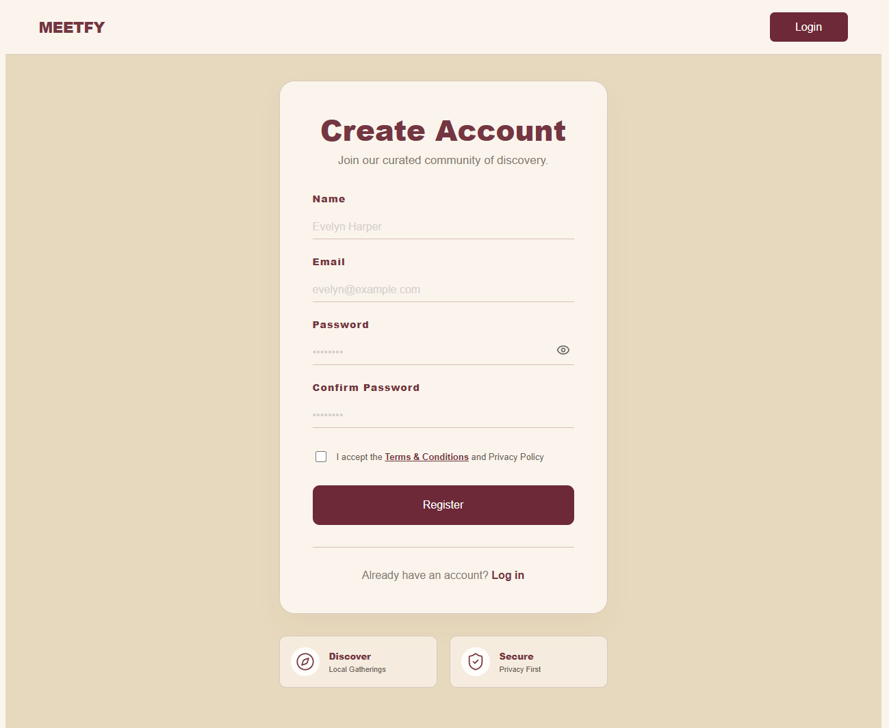

**Zrzut ekranu: ekran logowania**

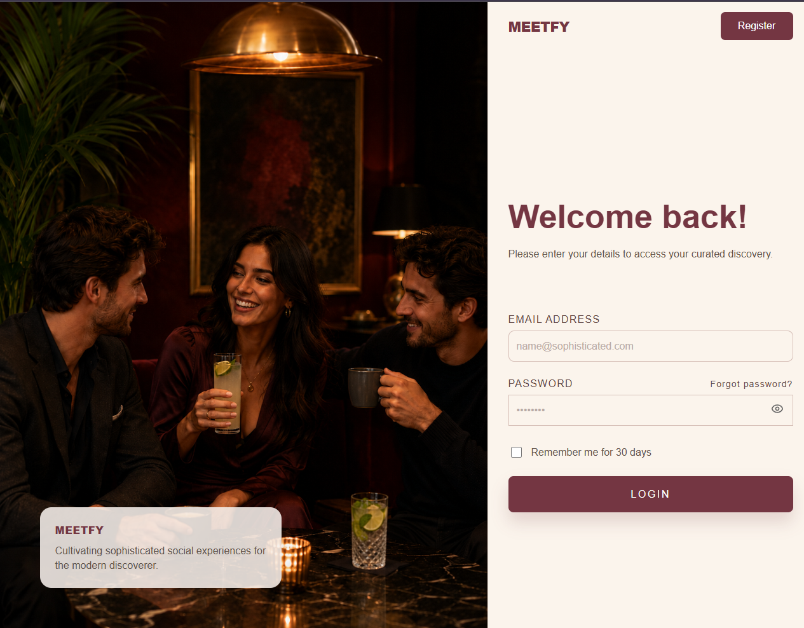

**Zrzut ekranu: użytkownicy w Firebase Authentication**

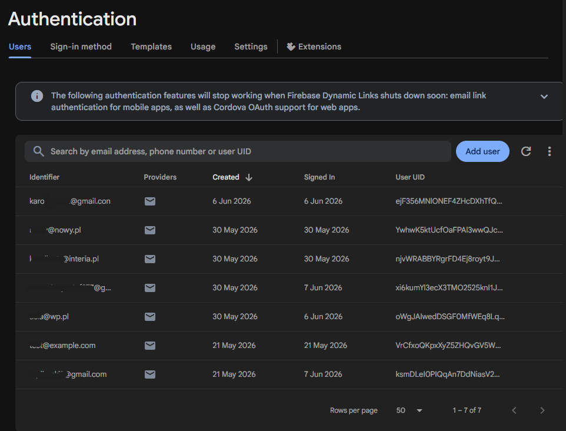

## 7. Zarządzanie danymi w AppDataContext

Aplikacja nie korzysta z klasycznego backendu ani bazy danych. Dane aplikacyjne są przechowywane lokalnie w przeglądarce z wykorzystaniem localStorage. Centralnym miejscem zarządzania stanem jest plik:

```bash 
src/context/AppDataContext.jsx 
```

Context przechowuje i udostępnia między innymi:

- authUser
- authLoading
- currentUserProfile
- userProfiles
- events
- favoriteEvents
- myEvents

Udostępniane funkcje obejmują między innymi:
```bash
loginUser()
registerUser()
logoutUser()
updateCurrentUser()
updateCurrentUserPreferences()
createEvent()
joinEvent()
addToFavorites()
removeFromFavorites()
removeFromMyEvents()
resetLocalDemoData()
```

Dzięki temu poszczególne widoki nie muszą samodzielnie zarządzać danymi aplikacji. Mogą korzystać z gotowych funkcji contextu.

Dane są zapisywane w localStorage przy każdej zmianie odpowiedniego stanu. Dzięki temu po odświeżeniu strony użytkownik nie traci utworzonych wydarzeń, ulubionych wydarzeń ani zapisanych preferencji.

## 8. Dane początkowe aplikacji

Aplikacja posiada zestaw przykładowych danych startowych. Są one przechowywane w plikach:
```bash
src/data/initialEvents.js
src/data/initialUsers.js
```

Plik initialEvents.js zawiera przykładowe wydarzenia widoczne w aplikacji po pierwszym uruchomieniu. Dane obejmują między innymi:

- tytuł wydarzenia,
- kategorię,
- cenę,
- datę,
- lokalizację,
- opis,
- organizatora,
- grafikę wydarzenia.

Plik initialUsers.js zawiera przykładowe dane profilu użytkownika, ale nie zawiera haseł, ponieważ hasła są obsługiwane przez Firebase Authentication.

## 9. Preferences Creator

Widok Preferences Creator pozwala użytkownikowi określić własne preferencje dotyczące wydarzeń. Użytkownik może wybrać między innymi:

- zainteresowania,
- atmosferę wydarzenia,
- wielkość grupy,
- maksymalną odległość,
- budżet,
- preferowaną datę,
- porę dnia,
- typ otoczenia.

Po kliknięciu przycisku zapisu preferencje są zapisywane w profilu użytkownika w localStorage. Po ponownym wejściu na stronę kreatora preferencji aplikacja odczytuje ostatnio zapisane dane i wypełnia formularz poprzednimi wyborami.

**Zrzut ekranu: kreator preferencji**

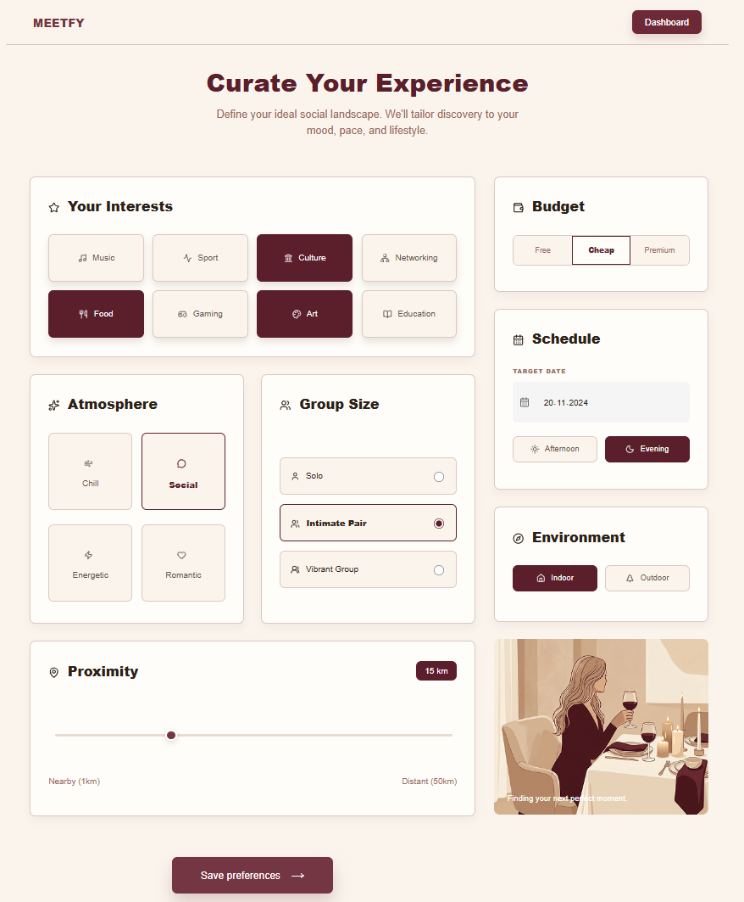

## 10. User Dashboard

Dashboard jest głównym panelem użytkownika po zalogowaniu. Zawiera sekcję powitalną, spersonalizowane rekomendacje oraz sekcję Discover Near You.

Dashboard korzysta z danych znajdujących się w contextcie aplikacji. Oznacza to, że utworzone przez użytkownika wydarzenia oraz wydarzenia startowe mogą pojawiać się w tym widoku.

W dashboardzie zaimplementowano również karuzelę wydarzeń. Przyciski strzałek pozwalają przełączać widoczne karty wydarzeń. Użytkownik może również otworzyć szczegóły wydarzenia lub dodać wydarzenie do ulubionych.

**Zrzut ekranu: dashboard z wydarzeniami**

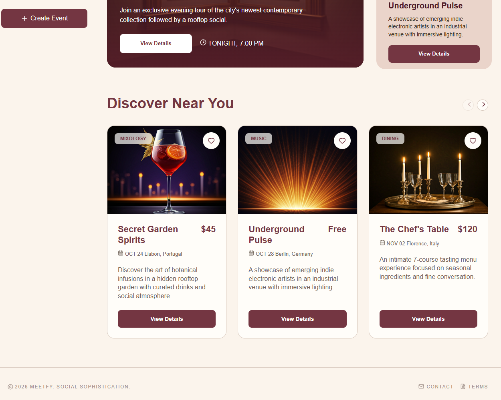

## 11. Event Details Modal

Szczegóły wydarzeń są wyświetlane w modalu EventDetailsModal. Modal pojawia się po kliknięciu przycisku View Details na karcie wydarzenia.

Modal prezentuje:

- obraz wydarzenia,
- tytuł,
- datę i godzinę,
- lokalizację,
- organizatora,
- cenę,
- opis wydarzenia,
- sekcję uczestników,
- przyciski Join Event oraz Add to Favorites.

Przycisk Join Event dodaje wydarzenie do listy My Events i przekierowuje użytkownika do strony z jego wydarzeniami. Przycisk Add to Favorites dodaje wydarzenie do listy ulubionych i przekierowuje użytkownika do strony Favorites.

**Zrzut ekranu: modal szczegółów wydarzenia**

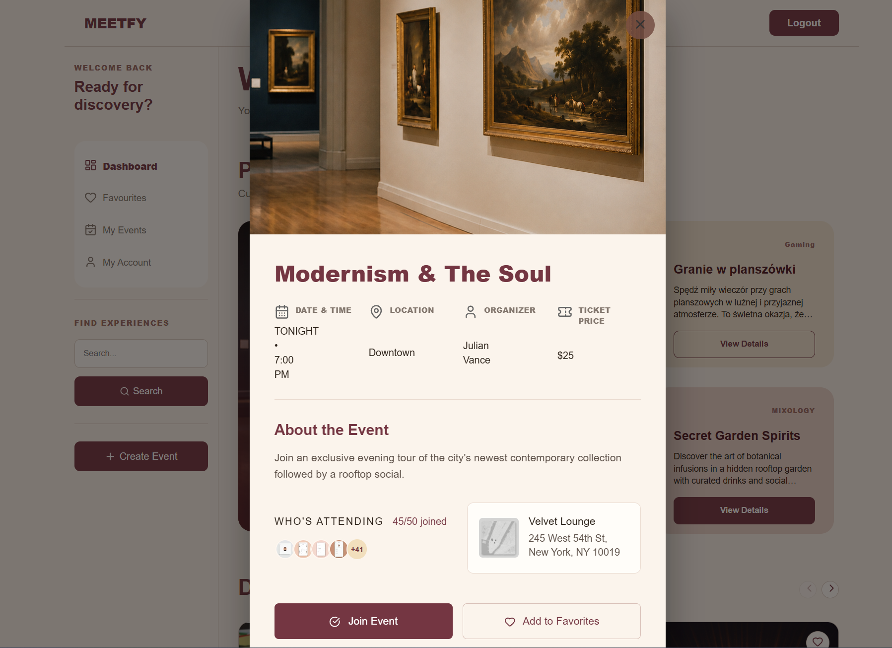

## 12. Create Event Page

Widok Create Event Page umożliwia użytkownikowi utworzenie nowego wydarzenia. Formularz zawiera pola takie jak:

- obraz wydarzenia,
- tytuł,
- kategoria,
- lokalizacja,
- data,
- godzina,
- cena,
- limit uczestników,
- opis,
- opcja wydarzenia indoor,
- opcja publicznej widoczności.

Użytkownik może wybrać obraz z komputera w formacie JPG lub PNG. Obraz jest odczytywany przez FileReader i zapisywany jako base64/data URL w obiekcie wydarzenia. Dzięki temu obraz jest widoczny później w My Events, Dashboard, Search oraz Favorites.

Jeżeli użytkownik nie wybierze obrazu, aplikacja automatycznie przypisuje losowy obraz z przygotowanej puli grafik stockowych.

Po utworzeniu wydarzenia jest ono zapisywane w localStorage oraz dodawane do listy wydarzeń użytkownika.

**Zrzut ekranu: formularz tworzenia wydarzenia**

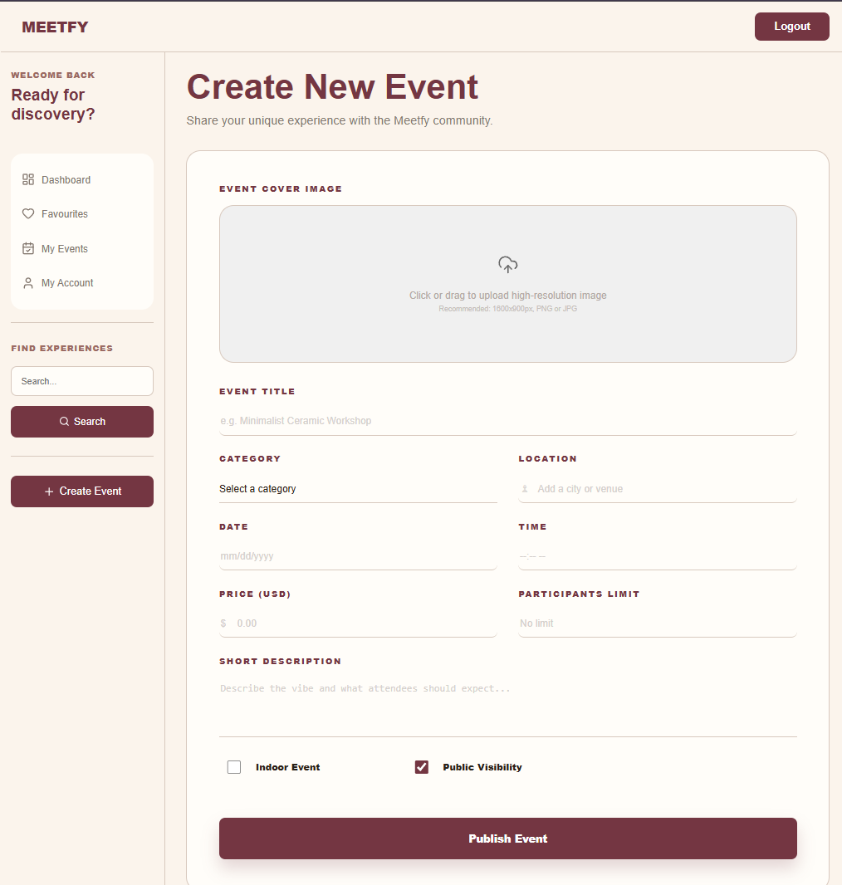

**Zrzut ekranu: wydarzenie utworzone przez użytkownika**

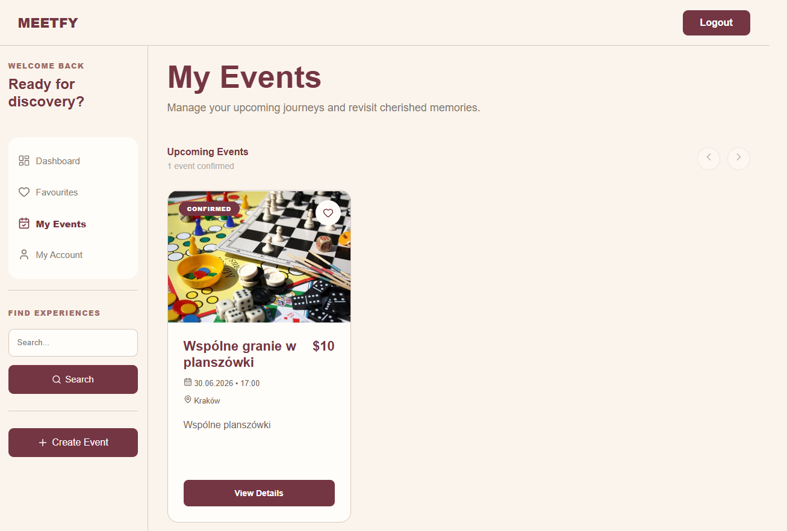

## 13. Favorites Page

Favorites Page prezentuje wydarzenia dodane przez użytkownika do ulubionych. Dane są pobierane z favoriteEvents w AppDataContext.

Użytkownik może:

- przeglądać ulubione wydarzenia,
- otworzyć szczegóły wydarzenia,
- usunąć wydarzenie z ulubionych,
- przełączać widoczne wydarzenia za pomocą strzałek.

Widok wykorzystuje komponent FavoriteEventCard, co pozwala zachować spójny wygląd kart.

**Zrzut ekranu: strona ulubionych wydarzeń**

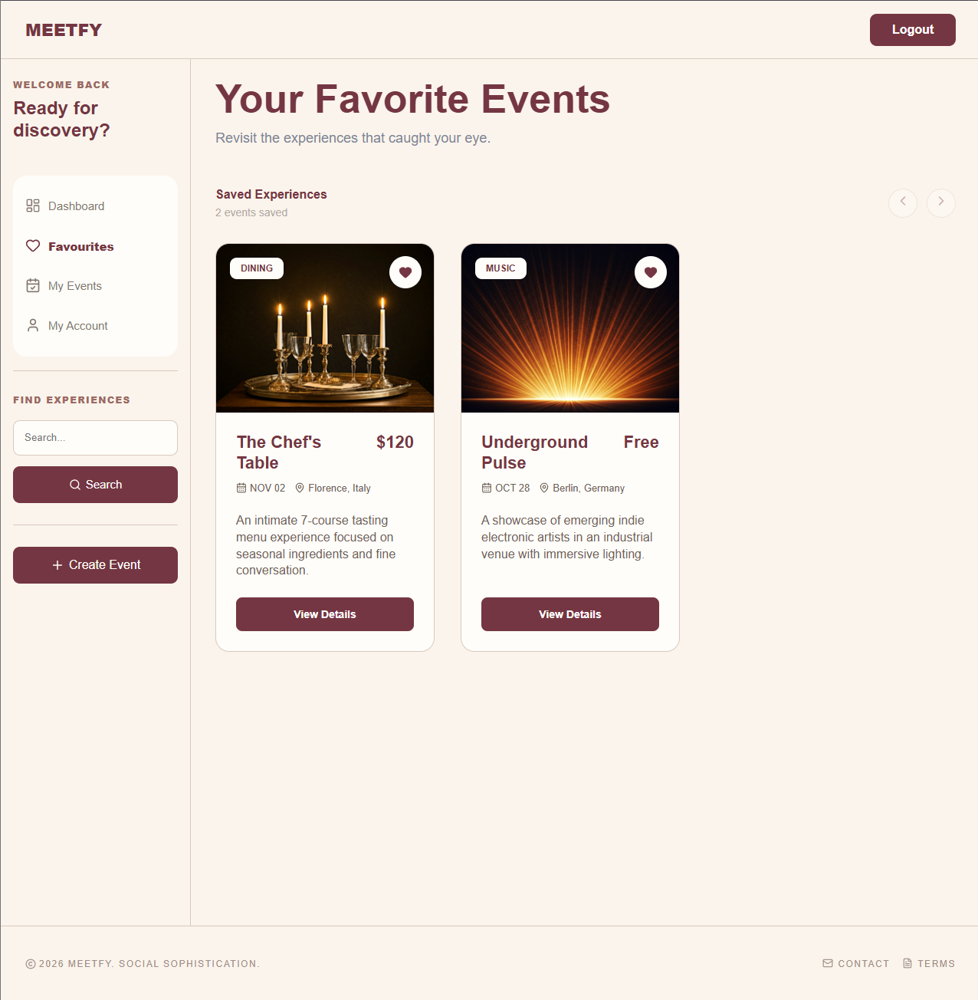

## 14. My Events Page

My Events Page prezentuje wydarzenia, do których użytkownik dołączył lub które sam utworzył. Dane są pobierane z myEvents w AppDataContext.

Użytkownik może:

- przeglądać swoje nadchodzące wydarzenia,
- otwierać szczegóły wydarzeń,
- usuwać wydarzenia z listy My Events,
- przełączać widoczne wydarzenia za pomocą strzałek,
- przeglądać przykładowe wydarzenia historyczne.

Dodanie wydarzenia do My Events następuje po kliknięciu Join Event w modalu szczegółów wydarzenia albo po utworzeniu nowego wydarzenia przez formularz Create Event.

**Zrzut ekranu: strona My Events**

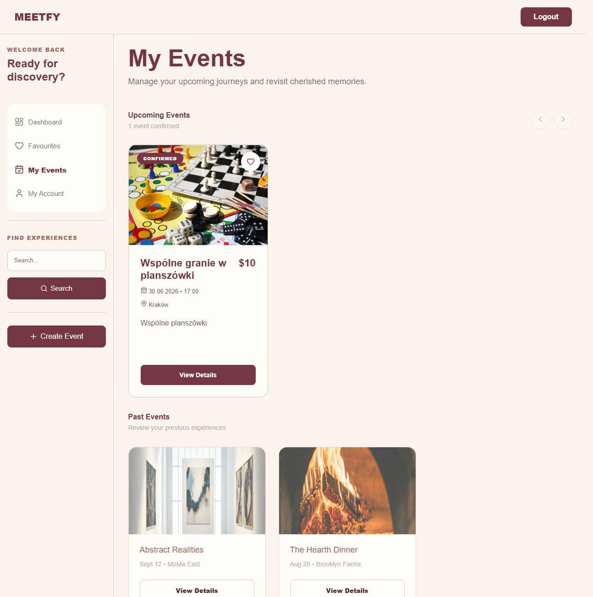

## 15. Search Page

Search Page umożliwia użytkownikowi wyszukiwanie wydarzeń. Wyszukiwanie działa po frazie przekazywanej w adresie URL, np.:

```bash 
/search?q=jazz 
```

Dodatkowo zaimplementowano proste filtry:

- kategoria,
- cena,
- data,
- lokalizacja.

Filtry działają przez cykliczną zmianę wartości po kliknięciu przycisku. Reset filtrów czyści tylko aktywne filtry, ale zostawia frazę wyszukiwania. Dzięki temu użytkownik może wyszukać konkretne wydarzenie i eksperymentować z filtrami bez utraty zapytania.

Wyniki są filtrowane po tytule, kategorii, tagu, lokalizacji, opisie i organizatorze.

**Zrzut ekranu: strona wyszukiwania**

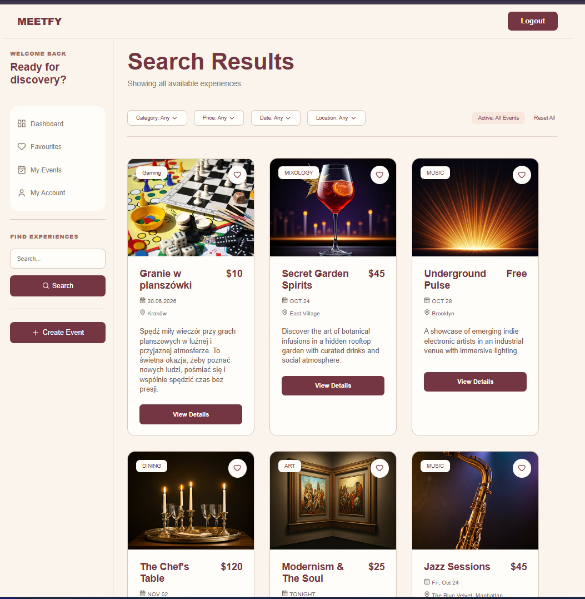

**Zrzut ekranu: użycie filtrów**

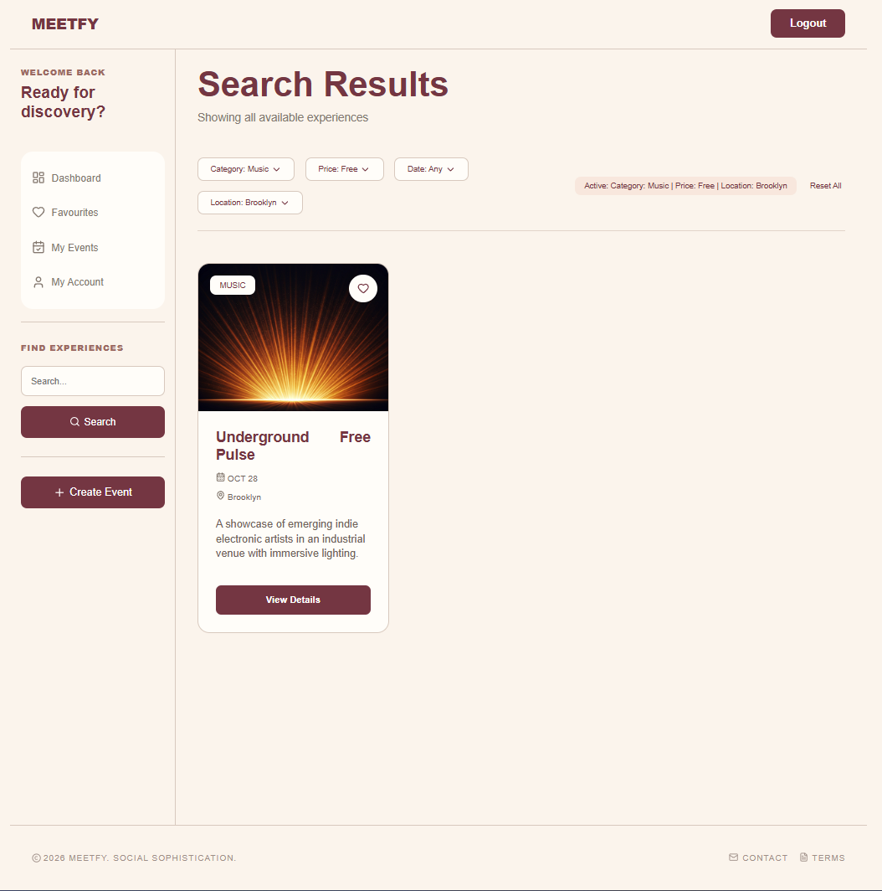

## 16. My Account Page

My Account Page umożliwia użytkownikowi zarządzanie swoim profilem. Dane profilu są przechowywane lokalnie i powiązane z aktualnym użytkownikiem Firebase przez uid.

Użytkownik może edytować:

- imię,
- nazwisko,
- numer telefonu,
- lokalizację,
- avatar.

Adres email jest wyświetlany jako pole tylko do odczytu, ponieważ pochodzi z Firebase Authentication.

Zmiana avataru działa na podobnej zasadzie jak upload obrazu wydarzenia. Użytkownik wybiera plik JPG lub PNG, a aplikacja zapisuje go jako base64 w localStorage. Przycisk Remove usuwa aktualny avatar i przywraca domyślny obraz.

Na stronie konta widoczny jest również skrót zapisanych preferencji użytkownika.

**Zrzut ekranu: strona My Account**

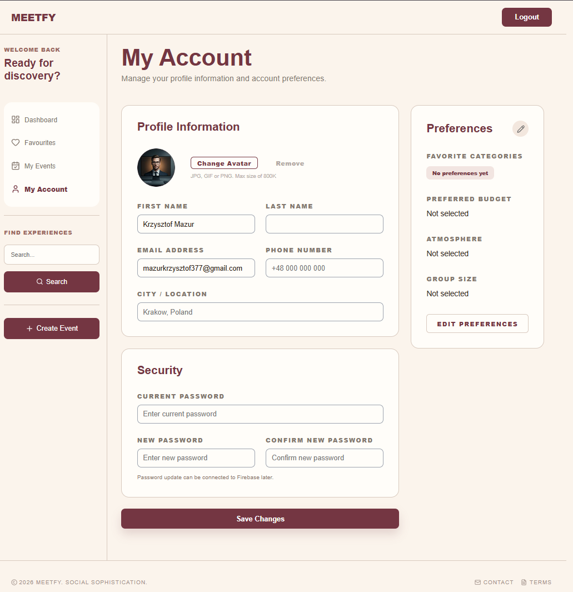

**Zrzut ekranu: zmiana avataru**

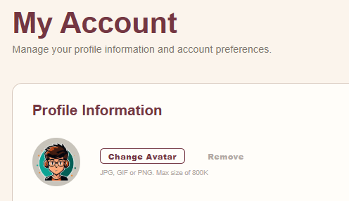

## 17. Contact Page

Contact Page zawiera formularz kontaktowy oraz informacje kontaktowe. Formularz pozwala podać:

- imię i nazwisko,
- adres email,
- temat,
- numer telefonu,
- treść wiadomości.

Po wysłaniu formularza aplikacja tworzy link mailto: do adresu:

meetfy8@gmail.com

Dzięki temu otwierany jest domyślny klient poczty użytkownika z przygotowaną wiadomością. Rozwiązanie nie wymaga backendu i jest bezpieczne dla aplikacji frontendowej, ponieważ nie przechowuje żadnych danych dostępowych do skrzynki pocztowej w kodzie klienta.

Logo Meetfy na Contact Page prowadzi do strony głównej dla niezalogowanych użytkowników albo do dashboardu dla użytkowników zalogowanych.

**Zrzut ekranu: Contact Page**

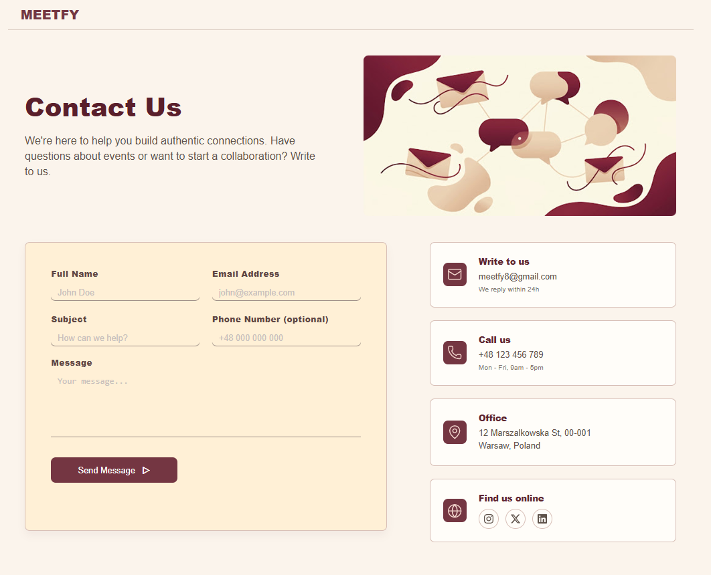

## 18. Google Analytics

Projekt został zintegrowany z Google Analytics. W aplikacji dodano listener, który reaguje na zmianę ścieżki w React Router i wysyła pageview do Google Analytics.

Jest to szczególnie istotne w aplikacji typu SPA, ponieważ przechodzenie między widokami nie powoduje pełnego przeładowania strony. Bez takiego listenera narzędzie analityczne mogłoby zarejestrować jedynie pierwsze wejście na aplikację, ale nie przejścia między podstronami.

Przykładowo rejestrowane są przejścia na trasy:
```bash
 /
 /login
 /register
 /dashboard
 /search
 /favorites
 /events
 /account
 /create-event
 /contact
```

Integracja została wykonana z użyciem biblioteki react-ga4. Kod inicjalizuje Google Analytics przy starcie aplikacji, a osobny komponent nasłuchuje zmian adresu i wysyła informację o pageview.

**Zrzut ekranu: konfiguracja Google Analytics w kodzie**

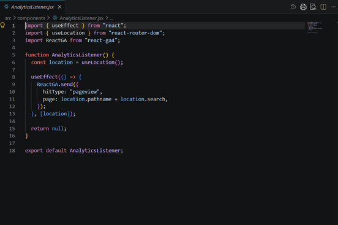

**Zrzut ekranu: panel Google Analytics / Firebase Analytics**

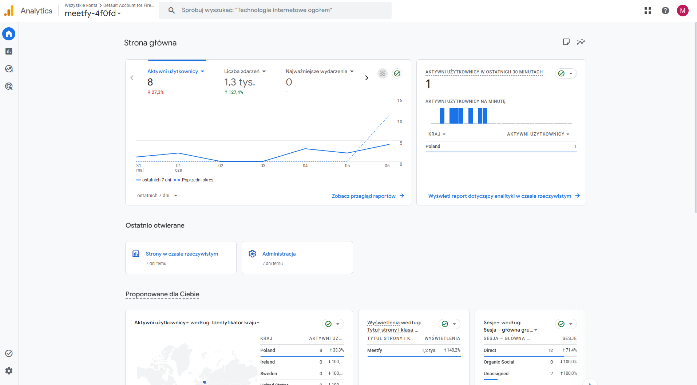

**Zrzut ekranu: widoczne wejścia lub page views**

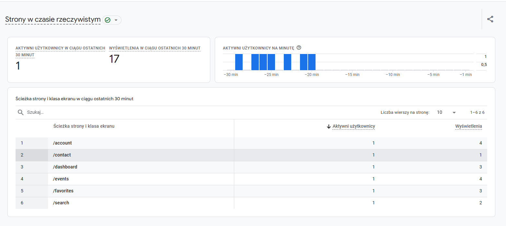

## 19. Hotjar / Contentsquare

Projekt został również zintegrowany z narzędziem Hotjar/Contentsquare. Narzędzie to umożliwia analizę zachowania użytkowników na stronie, w tym:

- heatmapy,
- nagrania sesji,
- kliknięcia,
- scrollowanie,
- analizę podstawowych metryk zachowania.

Integracja została wykonana przez dodanie skryptu trackingowego do pliku index.html. Skrypt został wygenerowany w panelu Hotjar/Contentsquare i wczytuje narzędzie analityczne po wejściu użytkownika na stronę.

Po wdrożeniu aplikacji na publiczny adres Railway wykonano weryfikację instalacji w panelu Hotjar/Contentsquare.

**Zrzut ekranu: skrypt Hotjar/Contentsquare w kodzie**

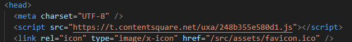

**Zrzut ekranu: weryfikacja instalacji Hotjar**

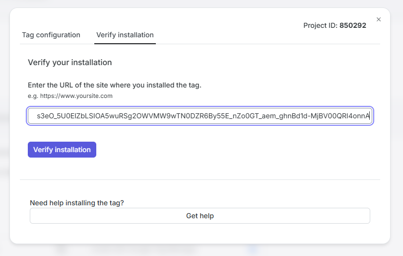

**Zrzut ekranu: dashboard Hotjar/Contentsquare**

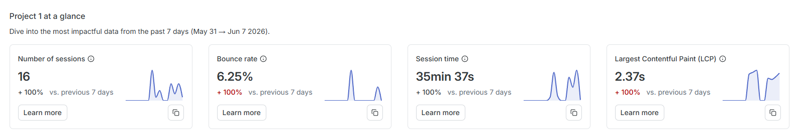

**Zrzut ekranu: heatmapa lub session replay**

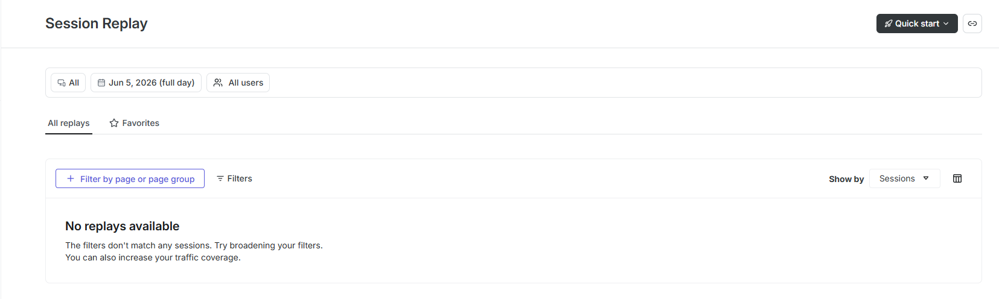

## 20. Deploy aplikacji

Aplikacja została wdrożona publicznie z wykorzystaniem Railway. Railway umożliwia szybki deploy aplikacji z repozytorium GitHub oraz wygenerowanie publicznej domeny.

Proces wdrożenia obejmował:

- Przygotowanie produkcyjnego buildu aplikacji.
- Dodanie skryptu startowego dla Railway.
- Połączenie projektu Railway z repozytorium GitHub.
- Dodanie zmiennych środowiskowych w panelu Railway.
- Uruchomienie deployu.
- Wygenerowanie publicznego adresu aplikacji.
- Dodanie domeny Railway do autoryzowanych domen Firebase Authentication.
- Weryfikację działania aplikacji na publicznym URL.

Przykładowe skrypty w package.json:
```bash
{
  "scripts": {
    "dev": "vite",
    "build": "vite build",
    "start": "serve -s dist -l $PORT",
    "preview": "vite preview"
  }
}
```

Do serwowania gotowego buildu produkcyjnego wykorzystano pakiet serve, który udostępnia folder dist.

**Zrzut ekranu: projekt w Railway**

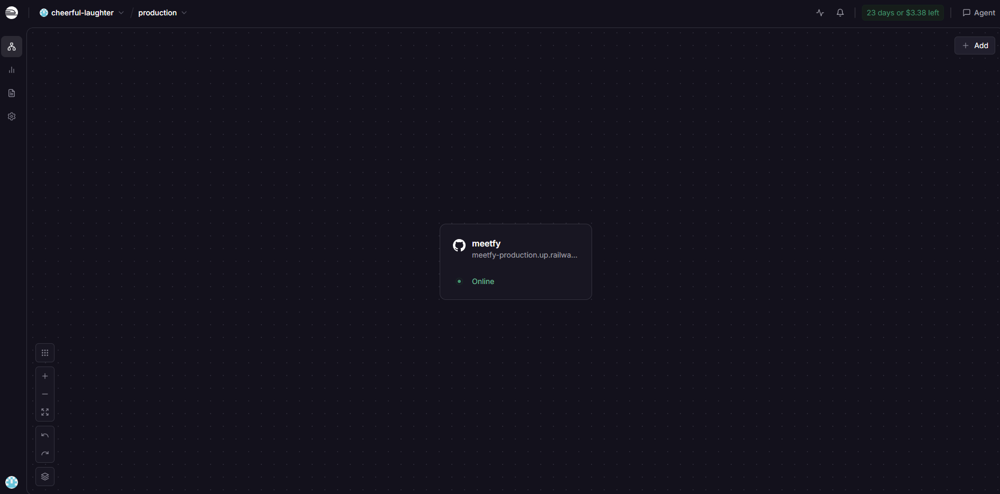

**Zrzut ekranu: deploy zakończony sukcesem**

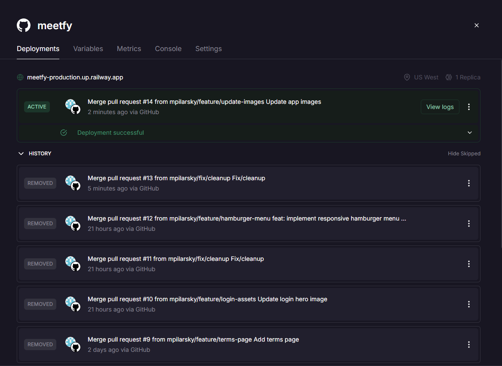

**Zrzut ekranu: publiczny URL aplikacji**

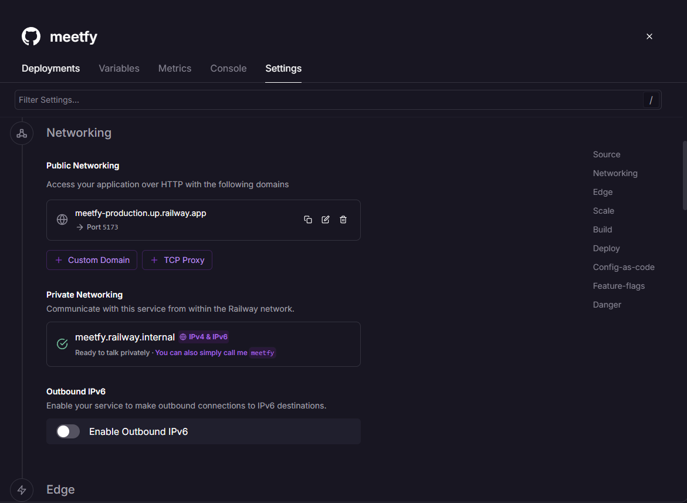

## 21. Zmienne środowiskowe

W projekcie wykorzystano zmienne środowiskowe przechowywane lokalnie w pliku .env oraz skonfigurowane na Railway.

Przykładowe zmienne:
```bash
VITE_FIREBASE_API_KEY=...
VITE_FIREBASE_AUTH_DOMAIN=...
VITE_FIREBASE_PROJECT_ID=...
VITE_FIREBASE_STORAGE_BUCKET=...
VITE_FIREBASE_MESSAGING_SENDER_ID=...
VITE_FIREBASE_APP_ID=...
VITE_FIREBASE_MEASUREMENT_ID=...
VITE_GA_MEASUREMENT_ID=...
```

Wszystkie zmienne używane przez Vite mają prefiks VITE_, ponieważ tylko takie zmienne są dostępne w kodzie aplikacji po stronie przeglądarki.

Plik .env nie powinien być dodawany do repozytorium. Wersja produkcyjna korzysta ze zmiennych ustawionych w panelu Railway.

**Zrzut ekranu: zmienne środowiskowe w Railway**

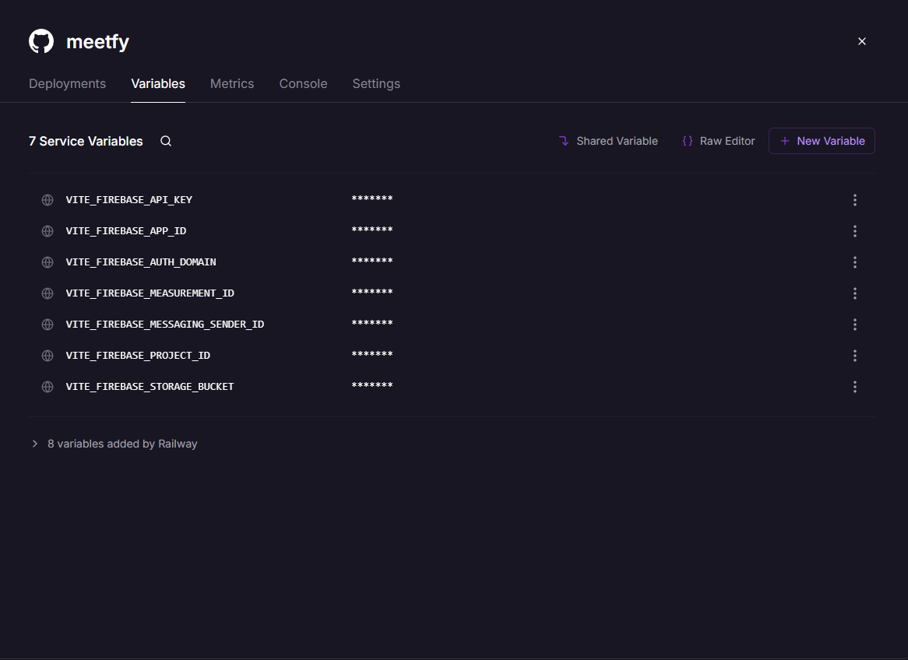

## 22. Bezpieczeństwo i ograniczenia projektu

Aplikacja została przygotowana jako projekt frontendowy, dlatego nie posiada klasycznego backendu ani zewnętrznej bazy danych dla wydarzeń. Dane takie jak wydarzenia, preferencje i ulubione są zapisywane w localStorage.

Takie rozwiązanie jest wystarczające dla projektu demonstracyjnego, ale ma ograniczenia:

- dane są przechowywane lokalnie tylko w przeglądarce użytkownika,
- dane mogą zostać usunięte po wyczyszczeniu localStorage,
- obrazy zapisane jako base64 mogą zajmować dużo miejsca,
- localStorage nie nadaje się do przechowywania poufnych danych,
- formularz kontaktowy nie wysyła maila automatycznie przez serwer, tylko korzysta z mailto:.

Hasła użytkowników nie są przechowywane w localStorage. Są obsługiwane przez Firebase Authentication.

W prawdziwej aplikacji produkcyjnej należałoby dodać backend lub bazę danych, np. Firestore, PostgreSQL albo inny system po stronie serwera. Obrazy wydarzeń i avatary powinny być przechowywane w zewnętrznym storage, np. Firebase Storage.

## 23. Testowanie funkcjonalności

W trakcie pracy przetestowano następujące scenariusze:

- Rejestracja i logowanie
- Użytkownik zakłada konto.
- Konto pojawia się w Firebase Authentication.
- Użytkownik loguje się na utworzone konto.
- Po zalogowaniu zostaje przekierowany do dashboardu.
- Logout wylogowuje użytkownika i przenosi go na stronę logowania.
- Preferencje
- Użytkownik wybiera preferencje.
- Kliknięcie Save preferences zapisuje dane w profilu użytkownika.
- Po ponownym wejściu do kreatora preferencji poprzednie dane są widoczne.
- My Account pokazuje podsumowanie zapisanych preferencji.
- Tworzenie wydarzenia
- Użytkownik wypełnia formularz Create Event.
- Użytkownik może dodać obraz z komputera.
- Wydarzenie zapisuje się w localStorage.
- Wydarzenie pojawia się na stronie My Events.
- Wydarzenie jest dostępne także w wyszukiwarce i dashboardzie.
- Ulubione wydarzenia
- Użytkownik otwiera szczegóły wydarzenia.
- Kliknięcie Add to Favorites dodaje wydarzenie do ulubionych.
- Wydarzenie pojawia się na Favorites Page.
- Kliknięcie serduszka usuwa wydarzenie z ulubionych.
- My Events
- Użytkownik klika Join Event w modalu.
- Wydarzenie trafia do My Events.
- Użytkownik może usunąć wydarzenie z listy.
- Strzałki pozwalają przełączać widoczne karty.
- Search
- Użytkownik wpisuje frazę w sidebarze.
- Aplikacja przechodzi na adres /search?q=....
- Search Page filtruje wydarzenia po frazie.
- Użytkownik może dodatkowo używać filtrów.
- Reset filtrów usuwa filtry, ale nie usuwa frazy wyszukiwania.
- Analityka
- Użytkownik przechodzi między widokami.
- Google Analytics rejestruje page views.
- Hotjar/Contentsquare rejestruje sesje i zachowanie użytkownika.
## 24. Podsumowanie

Projekt Meetfy realizuje założenia aplikacji frontendowej z rozbudowanym interfejsem użytkownika i wieloma interaktywnymi funkcjami. Aplikacja wykorzystuje React, Vite, React Router, Firebase Authentication, localStorage, Google Analytics, Hotjar/Contentsquare oraz Railway.

W projekcie udało się zaimplementować:

- pełną nawigację SPA,
- logowanie i rejestrację przez Firebase,
- lokalne zarządzanie danymi aplikacji,
- tworzenie i zapisywanie wydarzeń,
- upload obrazów wydarzeń i avatarów,
- obsługę ulubionych wydarzeń,
- obsługę wydarzeń użytkownika,
- wyszukiwarkę i filtry,
- karuzele wydarzeń,
- modal szczegółów wydarzenia,
- deploy publiczny,
- integrację z Google Analytics,
- integrację z Hotjar/Contentsquare.

Projekt pokazuje, w jaki sposób można stworzyć funkcjonalną aplikację frontendową bez klasycznego backendu, wykorzystując Firebase Authentication do obsługi kont oraz localStorage do demonstracyjnego przechowywania danych aplikacyjnych. Rozwiązanie jest wystarczające dla projektu zaliczeniowego i pozwala zaprezentować najważniejsze techniki projektowania i implementacji nowoczesnego frontendu.